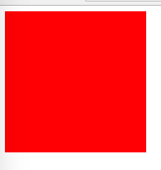

AngularJS1 Directive Template Namespace Svg Demo
================================================

`templateNamespace: 'svg'` is needed when using svg tags in directive, since they can't be handled as normal html tags,
and angularjs needs to know this information.

```
npm install
open index.html
```



Resources
---------

- AngularJS1: <https://angularjs.org/>
- directive api: <https://docs.angularjs.org/api/ng/service/$compile#directive-definition-object>
- $element api: <https://docs.angularjs.org/api/ng/function/angular.element#angularjs-s-jqlite>